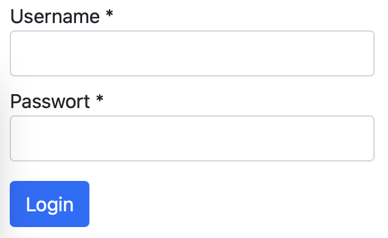

# Dynamic Forms in Angular mit Formly

## Einleitung
Formulare sind auf beinahe jeder Webappliaktion zu finden. Angular stellt dabei 2 verschiedene Ansätze zur Verfügung um Formulare zu implementieren: "Reactive forms" und "Template-driven forms". Formly ist eine Angular Library um Reactive Forms aus einem Config Objekt zu generieren.

## Setup
Um Formly zu verwenden muss das NPM Paket hinzugefügt werden:
```
ng add @ngx-formly/schematics --ui-theme=bootstrap
```
Zusätzlich installieren wir noch Bootstrap:
```
npm i bootstrap
```
Um Bootstrap auch wirklich verwenden zu können, muss das css File noch im angular.json angegeben werden:
```
{
  ...
  "projects": {
    "projectname": {
      ...
      "architect": {
        "build": {
          ...
          "options": {
            ...
            "styles": [
              "node_modules/bootstrap/dist/css/bootstrap.min.css",
              "src/styles.scss"
            ]
          }
        }
      }
    }
  }
}
```

## Login Formular erstellen
Ein Formular in Formly wird im .html File wie folgt definiert:
```
<form [formGroup]="form">
  <formly-form [form]="form" [fields]="fields" [model]="model"></formly-form>
</form>
```
Die verwendeten Variablen werden im .ts File definiert:
```
form = new FormGroup({});
model: User = {};

fields: FormlyFieldConfig[] = [
  {
    key: 'username',
    type: 'input',
    className: 'd-block mt-2',
    templateOptions: {
      label: 'Username',
      required: true,
    }
  },
  {
    key: 'password',
    type: 'input',
    className: 'd-block mt-2',
    templateOptions: {
      label: 'Passwort',
      type: 'password',
      required: true,
    }
  }
];
```
Die Fields werden als FolmlyFieldConfig Array angegeben. Ein FormlyFieldConfig beschreibt dabei 1 Formularelement.  

Type gibt die Art des Form Controls an. Input ist dabei ein normales Textfeld und wird von Formly standardmäßig zur Verfügung gestellt. Alle verfügbaren Default Types sind [hier](https://formly.dev/ui) aufgelistet. Es können auch Custom Types definiert werden. Dafür muss die Klasse FieldType extended werden. Genauere Infos dazu findest du [hier](https://formly.dev/guide/custom-formly-field).  

ClassName definiert die CSS Klassen für das Formularelement. Dieses Property ist optional.  

TemplateOptions erlaubt die Angabe von zusätzlichen Optionen.

Key ist der Name des Propertys im Model auf das der Wert vom FormControl gemappt werden soll. Folglich wird zum Beispiel der Wert des Username Inputs automatisch auf das Property "username" im Model gemappt. Das Interface User sieht daher folgendermaßen aus:
```
export interface User {
  username?: string;
  password?: string;
}
```

Um zu überprüfen ob die Verknüpfung von Formularfelder und Model richtig funktioniert fügen wir noch einen Login Button hinzu. Dieser soll bei Klick das Model in der Konsole ausgeben. Dafür muss der Button im .html File hinzugefügt werden:
```
<form [formGroup]="form" (ngSubmit)="login(model)">
  <formly-form [form]="form" [fields]="fields" [model]="model"></formly-form>
  <button type="submit" class="btn btn-primary mt-3">Login</button>
</form>
```

Zusätzlich muss die login Funktion im .ts File definiert werden:
```
login(model: User): void {
  console.log(model);
}
```

Unsere Formular sollte nun wie folgt aussehen:



Nach Klick auf Login sollten nun der eingegebene Username und das eingegebene Passwort in die Konsole geloggt werden.
