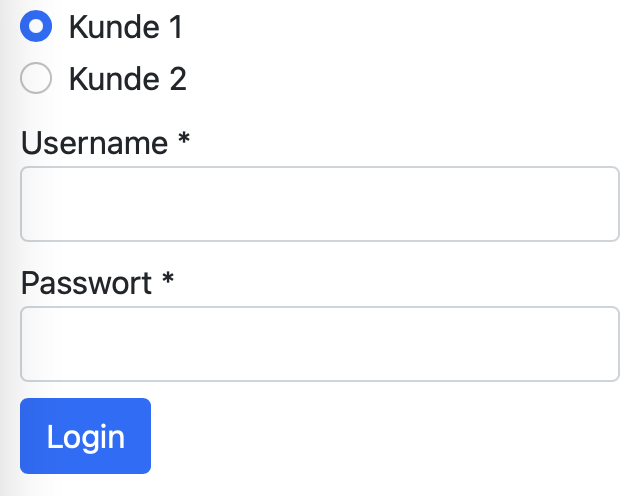
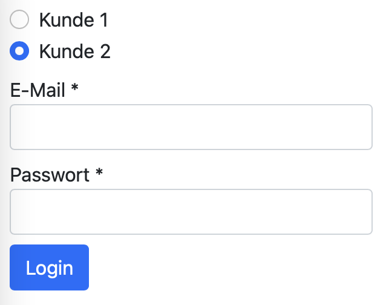

# Dynamic Forms in Angular mit Formly

## Einleitung
Formulare sind auf beinahe jeder Webappliaktion zu finden. Angular stellt dabei 2 verschiedene Ansätze zur Verfügung um Formulare zu implementieren: "Reactive forms" und "Template-driven forms". [Formly](https://formly.dev) ist eine Angular Library um Reactive Forms aus einem Config Objekt zu generieren.

## Setup
Um Formly zu verwenden muss das npm Paket hinzugefügt werden:
```
ng add @ngx-formly/schematics --ui-theme=bootstrap
```
Zusätzlich installieren wir noch Bootstrap:
```
npm i bootstrap
```
Um Bootstrap auch wirklich verwenden zu können, muss das css File noch im angular.json angegeben werden:
```json
{
  ...
  "projects": {
    "projectname": {
      ...
      "architect": {
        "build": {
          ...
          "options": {
            ...
            "styles": [
              "node_modules/bootstrap/dist/css/bootstrap.min.css",
              "src/styles.scss"
            ]
          }
        }
      }
    }
  }
}
```

## Login Formular erstellen
Ein Formular in Formly wird im .html File wie folgt definiert:
```html
<form [formGroup]="form">
  <formly-form [form]="form" [fields]="fields" [model]="model"></formly-form>
</form>
```
Die verwendeten Variablen werden im .ts File definiert:
```typescript
form = new FormGroup({});
fields: FormlyFieldConfig[] = [
  {
    key: 'username',
    type: 'input',
    className: 'd-block mt-2',
    templateOptions: {
      label: 'Username',
      required: true,
    }
  },
  {
    key: 'password',
    type: 'input',
    className: 'd-block mt-2',
    templateOptions: {
      label: 'Passwort',
      type: 'password',
      required: true,
    }
  }
];
model: User = {};
```
Die Fields werden als FolmlyFieldConfig Array angegeben. Ein FormlyFieldConfig beschreibt dabei 1 Formularelement.  

Type gibt die Art des Form Controls an. Input ist dabei ein normales Textfeld und wird von Formly standardmäßig zur Verfügung gestellt. Alle verfügbaren Default Types sind [hier](https://formly.dev/ui) aufgelistet. Es können auch Custom Types definiert werden. Dafür muss die Klasse FieldType extended werden. Genauere Infos dazu findest du [hier](https://formly.dev/guide/custom-formly-field).  

ClassName definiert die CSS Klassen für das Formularelement. Dieses Property ist optional.  

TemplateOptions erlaubt die Angabe von zusätzlichen Optionen.

Key ist der Name des Propertys im Model auf das der Wert vom FormControl gemappt werden soll. Folglich wird zum Beispiel der Wert des Username Inputs automatisch auf das Property "username" im Model gemappt. Das Interface User sieht daher folgendermaßen aus:
```typescript
export interface User {
  username?: string;
  password?: string;
}
```

Um zu überprüfen ob die Verknüpfung von Formularfelder und Model richtig funktioniert fügen wir noch einen Login Button hinzu. Dieser soll bei Klick das Model in der Konsole ausgeben. Dafür muss der Button im .html File hinzugefügt werden:
```typescript
<form [formGroup]="form" (ngSubmit)="login(model)">
  <formly-form [form]="form" [fields]="fields" [model]="model"></formly-form>
  <button type="submit" class="btn btn-primary mt-2">Login</button>
</form>
```

Zusätzlich muss die Funktion login() im .ts File definiert werden:
```typescript
login(model: User): void {
  console.log(model);
}
```

Unsere Formular sollte nun wie folgt aussehen:


Nach Klick auf Login sollten nun der eingegebene Username und das eingegebene Passwort in die Konsole geloggt werden.

## Dynamische Formulare
Da unser Formular in einem JSON Objekt definiert ist, muss diese Definition nicht zwingend am Frontend liegen. Alternativ kann das Formular auch am Backend definiert werden und ans Frontend geschickt werden. Dies kann nützlich sein um zum Beispiel das selbe Frontend für mehrere Kunden zu verwenden, auch wenn diese unterschiedliche Formularfelder nutzen wollen. Ein weiterer Anwendungsfall wäre die Möglichkeit ein Formular zu ändern ohne das Frontend neu ausliefern zu müssen.  
Angenommen Kunde 1 wünscht sich einen Login mit Username und Kunde 2 wünscht sich einen Login mit E-Mail. Um diesen Use Case mit Formly umzusetzen können wir dem Frontend je nach Kunde ein anderes Config Objekt bereit stellen. Für diese Demo mocken wir das Backend mit einem Service:
```typescript
@Injectable({
  providedIn: 'root'
})
export class LoginFormService {

  public getFields(kunde: Kunde): Observable<FormlyFieldConfig[]> {
    switch(kunde) {
      case Kunde.kunde1:
        return of([
          this.getUsernameField(),
          this.getPasswordField()
        ]);
      case Kunde.kunde2:
        return of([
          this.getEmailField(),
          this.getPasswordField()
        ]);
    }
  }

  private getUsernameField(): FormlyFieldConfig {
    return {
      key: 'username',
      type: 'input',
      className: 'd-block mt-2',
      templateOptions: {
        label: 'Username',
        required: true,
      }
    };
  }

  private getEmailField(): FormlyFieldConfig {
    return {
      key: 'email',
      type: 'input',
      className: 'd-block mt-2',
      templateOptions: {
        label: 'E-Mail',
        required: true,
      }
    };
  }

  private getPasswordField(): FormlyFieldConfig {
    return {
      key: 'password',
      type: 'input',
      className: 'd-block mt-2',
      templateOptions: {
        label: 'Passwort',
        type: 'password',
        required: true,
      }
    };
  }
}

export enum Kunde {
  kunde1,
  kunde2
}
```
Anschließend fügen wir 2 Radio Buttons hinzu um zwischen den beiden Kunden wechseln zu können:
```html
<div class="form-check mt-2">
  <input class="form-check-input" type="radio" name="radioKunde" id="radioKunde1" (change)="changeKunde(kunden.kunde1)" checked>
  <label class="form-check-label" for="radioKunde1">Kunde 1</label>
</div>
<div class="form-check">
  <input class="form-check-input" type="radio" name="radioKunde" id="radioKunde2" (change)="changeKunde(kunden.kunde2)">
  <label class="form-check-label" for="radioKunde2">Kunde 2</label>
</div>
```
Unser .ts File sollte folgendermaßen angepasst werden:
```typescript
form = new FormGroup({});
fields: FormlyFieldConfig[];
model: User;
kunden = Kunde;

private kunde$ = new BehaviorSubject(Kunde.kunde1);
private destroy$ = new Subject<boolean>();

constructor(private loginFormService: LoginFormService) {
}

ngOnInit(): void {
  this.kunde$
    .pipe(
      switchMap((kunde) => this.loginFormService.getFields(kunde)),
      takeUntil(this.destroy$)
    )
    .subscribe(fields => {
      this.model = {};
      this.fields = fields;
    });
}

ngOnDestroy(): void {
  this.destroy$.next(true);
  this.destroy$.unsubscribe();
}

login(model: User): void {
  console.log(model);
}

changeKunde(kunde: Kunde): void {
  this.kunde$.next(kunde);
}
```
Wir subscriben nun im Lifecycle Hook ngOnInit() auf den aktuell ausgewählten Kunden und holen uns anschließend von unserem gemockten Backend das richtige Config Objekt für die Formularfelder. Der aktuelle Kunde wird in einem BehaviourSubject gespeichert. Dieses wird beim auswählen eines Radio Buttons einfach genextet um einen neuen Kunden auszuwählen.  

Da wir nun auch ein E-Mail Feld haben muss dies auch in unserem Model abgebildet werden:
```typescript
export interface User {
  username?: string;
  email?: string;
  password?: string;
}
```
Unser Endresultat sieht nun folgendermaßen aus:



<br>

## Sourcecode
Den Sourcecode zu diesem Projekt kannst du [hier](https://github.com/jschu-fh-campus/we-blog) nachlesen.
